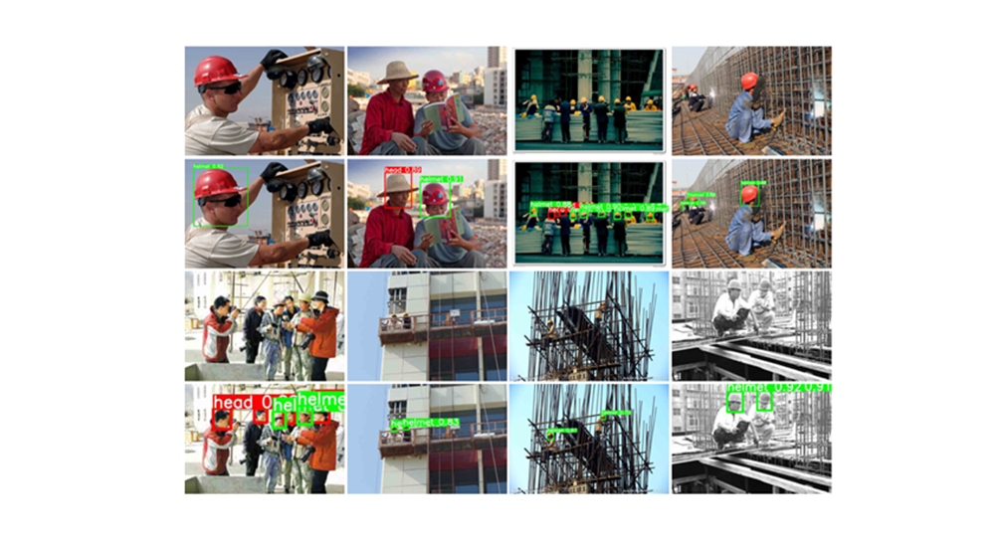

# YOLOG:An improved YOLOv5-based method of safety helmet-wearing detection on construction sites


## [Paper Page]() | [Code Page](https://github.com/Sun-Licheng/YOLOG)code coming soon!

**Tips**: If you meet any problems when reproduce our results, please contact Licheng Sun (Leecheng_sun@126.com). We are happy to help you solve the problems and share our experience.

### 💻Application Show
To further verify the proposed method, we applied it in construction. We have developed a helmet intelligent detection system and have already applied them on construction sites. Helmet intelligent detection can realize real-time high-precision safety helmet wearing detection in various complex construction. The results of the developed helmet intelligent detection system also strongly validate the proposed method.

The application is already compatible with Win10, ubuntu and centOS, and the [application documentation](./) will be available soon.


### 📔 Introduction

In this paper, we present YOLOG, based on our exploration of safety helmet-wearing detection algorithm on construction sites. Although some existing algorithms can achieve helmet detection in surveillance videos and images, their accuracy and speed are still poor, since the site is a complex environment with occlusion and clutters. And the model computation is also large and cannot be applied to construction scenes. In addition, safety helmets are smaller target objects. However, as the depth of the neural network increases, it may cause the loss of spatial information about objects, which may also cause problems such as missed objects. 

Therefore, a new safety helmet detection algorithm(You Only Look Once Globally) based on improved YOLO V5 is proposed. By using the proposed new multi-scale contextual aggregation module (MSCAM), we can aggregate multi-scale feature information in a global image, and highlight the details of concerned objects. This module solves the problem of incomplete feature information capture after feature aggregation and reduces the wrong and missed objects that often occur in safety helmet-wearing detection. In the Prediction structure, we still use the above idea. We combined the attention mechanism and dilated convolution in Detection Block, which can effectively extract feature maps while retaining high-frequency feature information. Extensive experiments show that the proposed method outperforms the state-of-the-art methods in detecting helmet-wearing on construction sites. Finally, to make the network lightweight, we add a basic convolutional network layer based on GhostNet, which makes the model greatly less computationally intensive, and add the prior knowledge of implicit information to accelerate the speed of the detection network.


### 🔧 Installation
Our code is being prepared and will be available soon after the paper is accepted.

In order to use YOLOG to detect safety helmets in construction sites, clone this repo:
```
git clone https://github.com/MegviiRobot/TransMVSNet.git
cd YOLOG
```
**Please:** Coming soon ! ! !

### 📦 Results



### 📊 Why YOLOG


The YOLOG is better suitable for safety helmet detection tasks and provides better detection of safety helmets in a construction environment. Our method is even faster and more accurate than the YOLOV7 for detecting helmets in construction environments.

#### ✔ Special note

 We have tested the comparison between the YOLOV7 and our method in real surveillance video. It can be seen that sometimes YOLO V7 will miss detection and misjudgment when detecting similar objects. Especially in the detection of ordinary hats and helmets, the number of missed detection or misjudgment occurs the most. In addition, in detecting small objects and edge objects, it can be seen that our method is obviously superior to state-of-the-art model–-YOLO V7.


#### ✔ Generalization

We verified the generalization and portability of the MSCAMNet and Detection network module in this paper. We directly transplant them to the YOLO V7 network without changing the network structure, and we can see that the detection performance of YOLO V7 is greatly improved.

| MSCAM               | Detect Block                                                                   | mAP0.5 | Speed(ms) | 
| --------------------------  | -------------------- | -------------------- | -------------------- | 
| ×  | × | 95.3                | 26                           | 
| √  | × | 95.8                | 24                          | 
| √  | √ |96.1                 | 24                         | 


## 📌 Acknowledgments
We borrow some code from [YOLO V3](https://github.com/ultralytics/yolov3) and [YOLO V5](https://github.com/ultralytics/yolov5). We thank the authors for releasing the source code.
